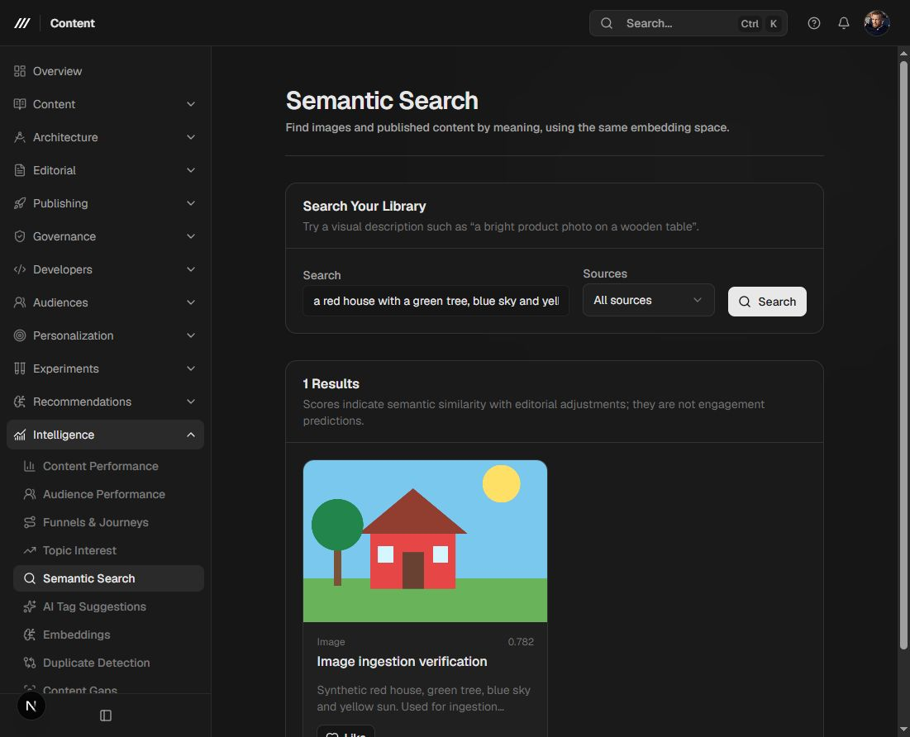

# Aiven vectors and Gemini setup

The research model is `User → Topic → Stage → Recommended Content`. Supabase remains the source of truth for application records, authentication, assets, exact events, consent, stages, and attributed knowledge. Aiven stores their derived semantic vectors. Geiger Events supplied the shared ScreenHeader, StatsBar, EditorSections, and settings layout conventions.

## Installed implementation

- Aiven pgvector 0.8.6, 768-dimensional vectors, cosine HNSW (`m=16`, `ef_construction=64`), and tenant-filtered retrieval with iterative scanning.
- One separately searchable embedding per image. Original files stay in Supabase Storage; server indexing validates the owned asset path and converts supported static images to bounded JPEG inputs.
- Published text is chunked conservatively. Jobs reuse completed chunks, retain the last complete revision, verify the current source before activation, and use processing leases.
- Verified Supabase sessions, project membership, and RBAC precede vector access. Shared search hydrates current eligible content; private knowledge is scoped to its owner.
- Interest vectors reuse existing content vectors with action weights and recency decay. They do not make a Gemini request for every interaction. The initial aggregator uses up to 40 distinct recent sources from a bounded 90-day activity window, one global vector, and at most five topic vectors. It accepts activity recorded by the authenticated vector activity endpoint; historical anonymous/collector events are not treated as verified personal signals.
- Consent withdrawal erases derived personal vectors immediately. A bounded worker reconciliation also checks removed sources and revoked/deleted profiles. Original events and knowledge records remain governed by Supabase's source retention policy.
- Private knowledge notes can be saved, removed, and searched from Embeddings → Your audience. Knowledge similarity does not establish expertise.
- Structured topic stages affect personalized eligibility. Content metadata may provide `journey_stages` as stage strings and `difficulty` as `beginner`, `intermediate`, or `advanced`. Explicit `not interested` stages exclude matching topics. Advanced content requires an experienced structured stage; untagged content remains eligible. The existing four-stage app taxonomy and research stage names are supported without deriving stage from vector similarity.
- Embeddings and Semantic Search use live APIs. Similar Content and Content-based Ranking use semantic results when available and label their keyword fallback.

## Server environment

Use ignored `.env.local` locally and your deployment's server environment in production. Never use `NEXT_PUBLIC_` for credentials.

| Variable | Purpose / initial value |
| --- | --- |
| `VECTOR_DATABASE_URL` | Aiven PostgreSQL connection URI; already configured locally |
| `VECTOR_DATABASE_CA_PATH` or `VECTOR_DATABASE_CA` | Aiven CA certificate for verified TLS; recommended for production |
| `GEMINI_API_KEY` | API key from your Google AI Studio project; configured locally, server-only |
| `VECTOR_APP_ORIGIN` | Optional explicit public origin behind a reverse proxy; otherwise writes validate Origin against the request Host and protocol |
| `VECTOR_WORKER_INTERVAL_MS` | Continuous local worker interval, default 60000; bounded to 15000–300000 |
| `GEMINI_DAILY_LIMIT` | Planning ceiling, initially 1000; replace with your project's actual quota |
| `GEMINI_RPM_LIMIT` | Conservative ceiling, initially 60; replace with your actual quota |
| `GEMINI_QUERY_RESERVE` | Daily request capacity reserved from ingestion, initially 200 |
| `VECTOR_STORAGE_BUDGET_BYTES` | Shared database safety ceiling, initially 700000000 |
| `CRON_SECRET` | Random server secret for the protected worker endpoint |
| `NEXT_PUBLIC_SUPABASE_URL`, `NEXT_PUBLIC_SUPABASE_ANON_KEY` | Existing application connection |
| `SUPABASE_SERVICE_ROLE_KEY` | Existing server-side source synchronization connection |
| `STRING_URI` | Existing Supabase ORM migration connection; unchanged target |

The supplied Aiven URI requests `sslmode=require`, which encrypts transport. Supplying the Aiven CA also verifies the server certificate. An absent `sslmode` defaults to certificate verification.

An AI Studio API key can use standard Gemini Embedding 2 on an eligible free-tier project without enabling billing. Image and text inputs are listed as free; Batch API is not available free. Quotas are per Google project, not per API key. The application does not enable billing, upgrade a project, or switch providers. Confirm actual limits in [AI Studio](https://aistudio.google.com/rate-limit); 1000/day and 100 RPM are measured planning figures, not guaranteed allowances. [Google pricing](https://ai.google.dev/gemini-api/docs/pricing#gemini-embedding-2), [rate limits](https://ai.google.dev/gemini-api/docs/rate-limits).

Google quota exhaustion returns HTTP 429 / `RESOURCE_EXHAUSTED`. The app exposes 429 with a retry time, preserves pending jobs, and defers work until retry/reset. Daily counters use midnight Pacific time. Local counters conservatively count attempted embedding requests, including failed requests; external calls from the same Google project are known only when Google rejects a request.

## Run it

1. Add `GEMINI_API_KEY` to the server environment and restart the app.
2. Sign in through the existing Supabase authentication flow and choose an accessible project. The public playground has no project/session and cannot index or search private data.
3. Open Intelligence → Embeddings, review Configuration, and select Index library. Image/text indexing can be toggled independently. Initial limits are 800 ingestion requests/day per project and 50000 total content/profile/knowledge vectors per project, subject to shared budgets.
4. Run `npm run vector:watch` alongside `npm run dev` for continuous local ingestion. It scans enabled projects every minute, processes bounded batches, retries transient failures, and stops gracefully on Ctrl+C. For a single batch, run `npm run vector:worker`, or use Run worker in the authenticated workspace. Retry jobs after correcting a missing key or invalid source.
5. Use Semantic Search with a visual/text description. Enable personalization in Your audience before recording personal likes or indexing knowledge.

For recurring processing, configure your deployment scheduler to GET `/api/cron/embeddings` with `Authorization: Bearer <CRON_SECRET>`. Production uses the app's `/content` base path, so its route is `/content/api/cron/embeddings`. No scheduler was enabled during this implementation. Do not expose the worker without its secret. CLI runs and authenticated worker calls share the same leases and budgets.

## Migrations and retention

`npm run vector:db:status` and `npm run vector:db:push` target only `postgres/migrations` in Aiven. `npm run db:status` and `npm run db:push` retain the existing Supabase target. Scaffold future changes with the corresponding `*:db:new` / `db:new` command; do not edit applied migrations.

Applied locally: Aiven `20260930074245_vector_intelligence.sql`, and Supabase `20260930074312_profile_knowledge.sql` plus `20260930115117_content_vector_grant_reads.sql`. The latter repairs a missing authenticated SELECT privilege that prevented the existing membership bootstrap. A restrictive policy limits grant reads to accessible projects and the caller or authorized team administrators. It adds no grant-writing privilege. Supabase's other existing migrations were preserved.

Each worker invocation prunes expired seven-day query caches, retired content vectors after one day, incomplete inactive revisions after seven days, completed/failed jobs after 30 days, minute counters after two days, and daily counters after 30 days. Query caches are capped at 1000 rows; the shared job ledger is capped at 100000 rows. Completed current content/knowledge vectors prevent unnecessary re-embedding after job-history cleanup. Personal derived vectors are physically removed on withdrawal; Supabase source records use their normal soft-delete behavior.

PostgreSQL vacuum/autovacuum makes deleted space reusable; deletion does not guarantee an immediate decrease in `pg_database_size`. The 700 MB guard is a conservative stop, not a promise about managed disk accounting. Monitor Aiven disk usage and index bloat. Source erasure and backups must also follow the configured Supabase/Aiven retention policies; this implementation does not delete source images or provider backups.

## Live verification

Controlled integration checks cover HNSW query plan/project isolation, concurrent staging and reversed job order, expired leases, profile lock/erasure, source-change recovery, rollback, quota reservation, and authenticated Supabase grant-read isolation. Regression checks cover the Next.js internal localhost/public Host mismatch and continuous-worker recovery/shutdown. Controlled database fixtures are rolled back or removed. Stop the continuous worker while running the live integration suite because it shares the queue with its test fixtures.

Final verification: **22 tests passed, zero failed or skipped**, scoped lint passed, and the Next.js production build passed. Migration status is Aiven 1 applied / 0 pending, Supabase 31 applied / 0 pending.

On 2026-09-30, the suite dashboard ran on `127.0.0.1:3000` and Content on `127.0.0.1:3010`. Sign-in through the dashboard successfully carried the Supabase session into Content. The account owns **Geiger Comms Demo** (`4ea32a09-f913-4b5f-8010-6395c3df7cdc`); the initial My Project URL was not in its accessible project list, and Test Project supplied only a Writer role. No existing role was elevated for this test.

The browser uploaded `docs/verification/image-ingest-test.png` as **Image ingestion verification** (`a473f60d-e42f-49f3-af31-0c4eb69d00c2`). The standard Gemini API returned a valid 768-dimensional image vector; the Aiven job completed on its first attempt. Searching for “a red house with a green tree, blue sky and yellow sun” returned the image with cosine similarity **0.782**. Repeating the query reused its cache. Re-syncing the unchanged source queued zero jobs and consumed no further embedding request. The synthetic image and its searchable asset are retained for inspection; the login password is not stored in application files.

A subsequent alt-text change was discovered and ingested by `vector:watch` without manually syncing or running the worker. Both source-revision jobs completed on their first attempt; only the current revision remains active. The complete live exercise used three embedding requests: the initial image, the search query, and the changed image revision.

Unsigned vector and cron requests return 401. Quota exhaustion is verified with simulated provider 429 responses and transactional budget tests; the real Google allowance was not deliberately exhausted. Measure retrieval quality and per-vector disk growth with representative data before relying on capacity estimates. Production still needs an external scheduler and its `CRON_SECRET`, or a supervised persistent worker; the local watcher is not a deployed production scheduler.
